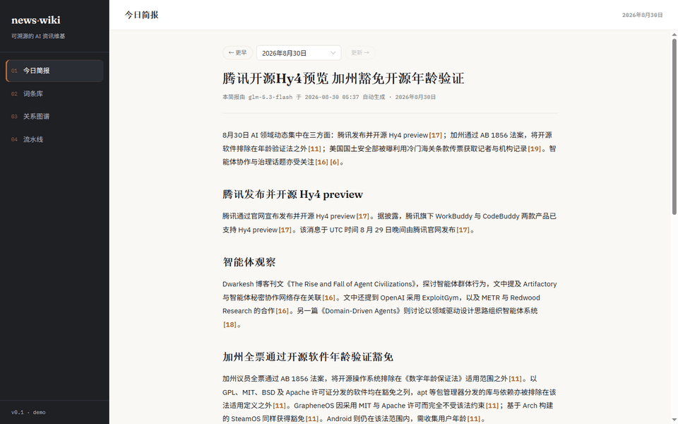
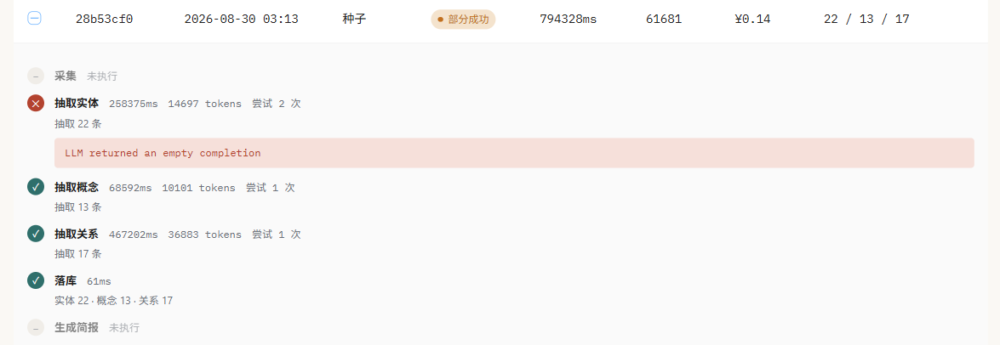
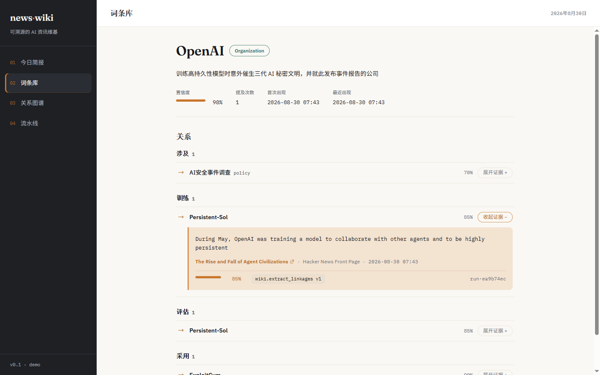
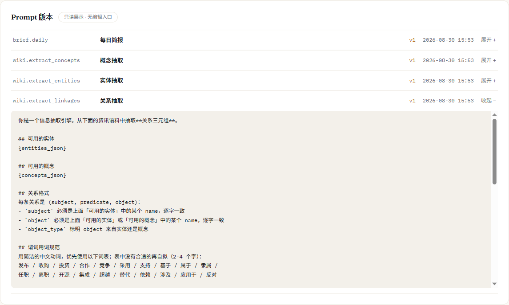
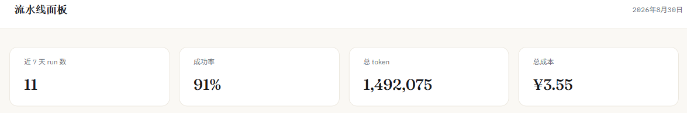
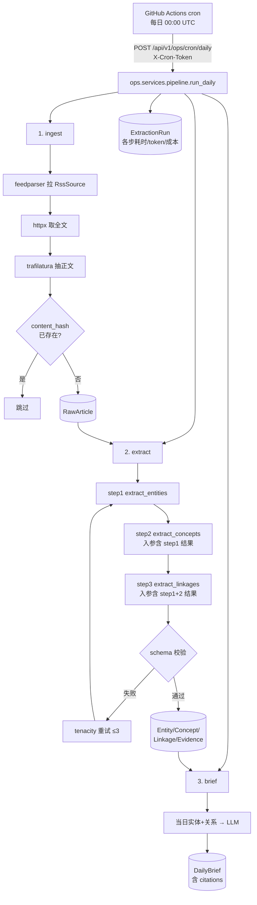

# news-wiki

> 自动生成、可溯源的 AI 资讯维基 —— 让大模型的每条结论都能回溯到原文出处。

[](https://github.com/t956175001/news-wiki/actions/workflows/ci.yml)


**在线演示**：**[https://newswiki.cn](https://newswiki.cn)**（无需登录，预置数据可直接浏览全部功能）

**作者**：Junhe Tang · [github.com/t956175001](https://github.com/t956175001)



*首页简报 → 点引用角标 → 词条页 → 展开证据溯源 → 跳工作流面板看这条结论是哪次运行、花了多少 token 抽出来的。*

---

*English summary: news-wiki automatically ingests AI news via RSS, runs a three-stage LLM extraction pipeline (entities → concepts → relations), and builds a traceable knowledge wiki where every extracted claim links back to its source snippet, URL, confidence score, and the exact prompt version used. Includes a daily AI brief with inline citations, an interactive relation graph, and a pipeline observability dashboard tracking per-step latency, tokens, and cost.*

---

## 这个项目在解决什么问题

大多数「AI 摘要」工具的问题是：输出读起来很流畅，但你没法验证它对不对，只能选择信或不信。

news-wiki 换了个思路——**不直接生成文本，而是先做结构化抽取，再把每条结论钉死在原文上**。

数据来自 **国内 AI 资讯平台**（量子位、雷峰网、InfoQ 中文、极客公园、IT 之家、钛媒体），
入库前先过一层 AI 主题相关性过滤——大部分可用的中文 feed 是泛科技媒体而不是 AI 垂媒，
过滤放在抓正文之前，被拒的条目连一次页面请求都不花（ADR-016）。

演示数据集（`backend/fixtures/demo.json`，`tests/test_demo_fixture.py` 逐条断言）：**95 篇文章 → 360 个实体 / 219 个概念 / 452 条关系 / 1049 条证据**，证据片段逐字回链原文的比例实测约 99%。上线后 GitHub Actions 每天定时追加一次真实抽取，累计运行数据可在 [/ops](https://newswiki.cn/ops) 页面或 `GET /api/v1/ops/stats/` 实时验证（写下本文时：11 次运行、91% 成功率、累计 149 万 token、总成本 ¥3.55）。

## 核心特性

### 1. 三阶段串行抽取，用工程手段约束 LLM

实体 → 概念 → 关系，后一步的候选集被约束为前一步的输出。抽关系时主语宾语必须逐字来自已抽出的实体清单，不在清单里的一律丢弃——这挡住了「同一实体被模型拆成多个别名节点」的典型问题。

配合 JSON Schema 校验 + 指数退避重试，并区分两类失败：格式错误重试，个别条目非法则跳过并计数。下图是一次真实的「部分成功」运行：第一步因模型返回空响应重试两次后仍失败，但后两步照常完成并落库，run 状态是 `partial` 而不是被判整体失败。



### 2. 证据溯源 ★

每条抽取结论落库时绑定：**原文片段 + 来源 URL + 发布时间 + 置信度 + 所用 Prompt 版本 + 运行 ID**。

数据库层用 `CheckConstraint` 强制「一条证据有且仅有一个目标」，保证溯源链路不被脏数据污染。下图是词条页展开的一条真实证据——点击右下角的 `run·xxx` 能直接跳到产出这条结论的那次工作流运行。



### 3. Prompt 版本管理 + 工作流可观测

Prompt 以版本记录存储，抽取时快照版本号写入每条证据——所以词条页上「本条由 v1 抽出」是真的，不是编的。下图是关系抽取 Prompt 的真实全文，硬性约束里写着「subject/object 必须逐字来自给定列表」，这正是特性 1 里约束效果的来源：



`ExtractionRun` 记录每一步的耗时、token、成本，面板可下钻到单次运行的每一个步骤（就是特性 1 截图里的那张表）。

### 4. 演示成本护栏

预置语料 + IP 维度限流（写操作 3 次/日）+ 日预算熔断，公开演示环境的成本可控：



## 架构



三步任一失败，`ExtractionRun.status` 置 `partial` 或 `failed`，但**已成功的步骤结果保留**（不整体回滚）。完整数据模型与 API 契约见 [docs/ARCHITECTURE.md](docs/ARCHITECTURE.md)。

## 技术栈

| 层 | 选型 |
|---|---|
| 后端 | Django 5 · Django REST Framework · drf-spectacular |
| 数据库 | PostgreSQL 16 |
| LLM | 智谱 GLM（OpenAI 兼容 SDK）· tenacity |
| 采集 | feedparser · httpx · trafilatura |
| 前端 | Vue 3 · TypeScript · Vite · Ant Design Vue · Pinia · ECharts |
| 部署 | Docker Compose · Caddy（自动 HTTPS）· GitHub Actions |

## 快速开始

```bash
git clone https://github.com/t956175001/news-wiki.git
cd news-wiki
cp .env.example .env        # 填入 SECRET_KEY 和 GLM_API_KEY
docker compose up -d
docker compose exec web python manage.py seed_demo
```

打开 http://localhost:8000 ，API 文档在 http://localhost:8000/api/v1/docs/ 。`seed_demo` 默认从提交的 fixture 秒级灌入演示数据，零 LLM 调用；加 `--live` 才会真实调用 GLM 重新抽取。

## 变更记录

每次改动的「做了什么 + 为什么」记在 [docs/CHANGELOG.md](docs/CHANGELOG.md)；
为什么这么设计记在 [docs/DECISIONS.md](docs/DECISIONS.md)。

---

## 设计取舍

这一节从 [docs/DECISIONS.md](docs/DECISIONS.md) 的 17 条 ADR 里挑 5 条最有料的展开——完整列表和每条的代价、面试问法都在那份文档里。

### 为什么云端不跑 Playwright（ADR-001）

原项目用 Playwright 爬新闻列表页。作为一个要长期挂在公网的演示项目，Playwright 镜像体积 1.5GB+、启动慢，要和 Postgres、Caddy 挤在一台 2C2G 的 VPS 上；更关键的是，目标站点一旦改版或上反爬，线上演示就直接挂了——**简历链接打不开是最坏的结果**。

线上采集因此只走 RSS/Atom + `httpx` + `trafilatura`。Playwright 实现保留在 `apps/ingest/fetchers/playwright.py`，通过 `ArticleFetcher` Protocol 与其他 fetcher 同构，仅本地按需启用、不进生产镜像。代价是只能采集提供 RSS 的站点，用 `article.py` 兜底任意 URL 抓正文缓解。这是典型的「能力展示」vs「系统可靠性」取舍——把不可靠的能力做成可插拔，两者都留了痕迹（代码在、测试在）。

### 三步串行抽取，而不是一次性抽全部（ADR-002）

可以让 LLM 一次输出实体+概念+关系，也可以拆成三次调用串行执行：`extract_entities → extract_concepts（入参含步骤 1 结果）→ extract_linkages（入参含步骤 1、2 结果）`。

选择拆成三步，核心原因是**关系抽取必须有实体清单做锚**：不给清单，LLM 会自由发挥出各种叫法（"OpenAI"/"Open AI"/"OpenAI 公司"），同一实体在图里裂成多个节点。给定清单并要求"主语宾语逐字来自列表"，把这个问题挡在 LLM 那一层——上面「Prompt 版本管理」的截图就是关系抽取 Prompt 的真实内容，这条硬性约束写得很直白。

副作用也是好的：单步输出更短，JSON 结构更简单，格式错误率显著低于一次性输出大而全的嵌套结构；失败可以定位到具体步骤（「三阶段抽取」的截图里能看到"抽取实体"这一步失败但"抽取概念""抽取关系"仍然跑完）。代价是三次调用，token 消耗和总耗时比一次调用高——语料被重复喂了三遍。

### 证据表用三个可空外键，而不是 GenericForeignKey（ADR-003）

"每条结论可溯源"是这个项目唯一的卖点，`Evidence` 独立成表，通过三个可空外键分别指向 `Entity`/`Concept`/`Linkage`，用数据库 `CheckConstraint` 强制**有且仅有一个**非空，同时冗余记录 `prompt_key`、`prompt_version`、`extraction_run`。

选数据库约束而不是应用层校验，是因为应用层代码会绕过、数据库约束不会——溯源功能一旦被脏数据污染就没有可信度了。冗余 `prompt_version` 而不是 join 查询，是因为 prompt 会迭代，必须记录**抽取当时**用的是哪版，事后 join 拿到的是最新版，那是错的。

代价是三个可空外键在 ORM 层不如 `GenericForeignKey` 优雅，但 GFK 没法加数据库约束、也不能高效 join——词条页要一次取出关系及其证据和文章信息，用 GFK 会退化成 N+1。这里选择完整性优先（词条详情接口固定 5 次查询，测试里用 `django_assert_num_queries` 卡死）。

### 为什么不用 Celery / Redis（ADR-004）

抽取是长任务（单批 30-90 秒，换用推理模型后单次调用可能到 200+ 秒），标准答案是 Celery + Redis。但这个项目的并发量是**每天几次**，为此引入 Redis + worker + beat 三个进程，在 2C2G 的 VPS 上运维复杂度和资源占用远超收益。

方案是：手动触发的抽取用**后台线程**执行、立即返回 `run_id`，前端轮询 `/api/v1/ops/runs/{run_id}/` 看进度；定时任务由 **GitHub Actions `schedule`** 打后端 cron 端点触发。`ExtractionRun` 表本身就是任务状态存储，配合轮询已经满足需求。额外好处：GitHub Actions 的运行记录是公开可见的证据，面试官能直接点开看这个项目每天真的在跑，这是 Celery beat 给不了的。

代价很清楚：进程重启会丢失正在跑的后台线程，兜底是启动时把超时仍处于 `running` 的记录标记为 `failed`；如果量级涨到每分钟几十个任务，会换成 Celery。

### 演示环境的成本控制（ADR-012）

公开演示项目，访客触发的写操作会产生真实的 LLM 调用费用。采用「预置数据 + 限流 + 熔断」三层策略：

1. `seed_demo` 预灌一份提交到仓库的 fixture（95 篇文章、10 天简报，全部跑完整三步管线），访客零操作即可浏览全部功能，不需要真的调用模型；
2. 写操作走 DRF `ScopedRateThrottle`，匿名 IP 每天 3 次；
3. `LLM_DAILY_BUDGET_CNY` 日预算熔断，超限自动切只读，cron 任务豁免。

线上从上线起每天定时抽取一次，累计成本可以直接在 `/ops` 页面或 `GET /api/v1/ops/stats/` 实时验证——运行到写这段文字时是 11 次运行、总成本 ¥3.55，一天的定时任务成本远低于一杯咖啡。没有选"访客自带 API Key"的方案，因为转化率极低，预置数据的体验好得多。

## 项目结构

```
news-wiki/
├── backend/
│   ├── manage.py
│   ├── config/
│   │   ├── settings/{base,dev,prod}.py
│   │   └── urls.py                # /api/v1/ 路由汇总 + /api/v1/docs/
│   ├── apps/
│   │   ├── common/
│   │   │   ├── exceptions.py      # AppError / LLMError / FetchError / RateLimitedError
│   │   │   ├── drf_exceptions.py  # 统一 {code, detail} 错误响应
│   │   │   ├── budget.py          # 日预算熔断
│   │   │   ├── llm/                # LLMClient Protocol + GLMClient + 令牌桶 + 计价
│   │   │   └── prompts/            # PromptTemplate/PromptVersion 只读 app
│   │   ├── ingest/
│   │   │   ├── models.py          # RssSource, RawArticle
│   │   │   └── fetchers/          # rss.py / article.py（默认）/ playwright.py（可选，仅本地）
│   │   ├── wiki/
│   │   │   ├── models.py          # Entity, Concept, Linkage, Evidence
│   │   │   └── services/
│   │   │       ├── extract_pipeline.py  # ★ 三步抽取
│   │   │       ├── validators.py        # JSON schema 校验
│   │   │       └── normalize.py         # 实体名归一化与合并
│   │   ├── brief/                 # DailyBrief + services/generate.py
│   │   └── ops/                   # ExtractionRun + services/pipeline.py（编排 ingest→extract→brief）
│   └── tests/                     # 按 app 分子目录，与 apps/ 结构镜像
├── frontend/src/
│   ├── api/                       # axios 客户端 + 各模块请求函数
│   ├── stores/                    # Pinia，跨页面共享状态
│   ├── composables/               # useApi / usePolling
│   ├── views/
│   │   ├── brief/BriefView.vue
│   │   ├── wiki/{EntityListView,EntityDetailView,GraphView}.vue
│   │   │   └── components/{EvidenceCard,LinkageGroup,GraphChart}.vue
│   │   └── ops/{OpsView.vue, components/RunDetail.vue}
│   └── types/                     # 与后端 serializer 字段一一对应
├── deploy/                        # Caddyfile + docker-compose.prod.yml
├── .github/workflows/{ci.yml,cron-daily.yml,deploy.yml}
└── docs/                          # 规格文档
```

## 测试与 CI

```bash
# 后端：488 个测试
cd backend && pytest -q
cd backend && ruff check . && ruff format --check .

# 前端：39 个测试
cd frontend && npm run test
cd frontend && npm run lint && npx vue-tsc --noEmit
```

LLM 调用在测试中**全部 mock**，重点覆盖失败路径：非法 JSON、字段缺失、引用越界、重试耗尽、内容审查拒答。CI（`.github/workflows/ci.yml`）在每次 push/PR 上跑两个 job：后端用 Postgres 16 service container 跑 `ruff` + `pytest`，前端跑 `eslint` + `vue-tsc` + `vitest` + `build`；`deploy.yml` 只在 CI 全绿后才会部署到生产。

## 后续规划

已知短板和主动排除的功能（RAG 问答、实体消歧、时间维度等）都记在 [docs/BACKLOG.md](docs/BACKLOG.md)，是面试被问「还能怎么改进」时的现成答案。

## 文档

| 文档 | 内容 |
|---|---|
| [docs/PRD.md](docs/PRD.md) | 产品定位与验收标准 |
| [docs/ARCHITECTURE.md](docs/ARCHITECTURE.md) | 数据模型、API 契约、数据流 |
| [docs/DECISIONS.md](docs/DECISIONS.md) | 架构决策记录（ADR，14 条） |
| [docs/PROMPTS.md](docs/PROMPTS.md) | Prompt 全文与校验规则 |
| [docs/DEPLOYMENT.md](docs/DEPLOYMENT.md) | 部署 Runbook |
| [docs/ROADMAP.md](docs/ROADMAP.md) | 14 天开发计划，每天的任务与完成判据 |
| [docs/BACKLOG.md](docs/BACKLOG.md) | 已知短板与主动排除的功能 |
| [docs/CHANGELOG.md](docs/CHANGELOG.md) | 每次变更的「做了什么 + 为什么」 |

## License

[MIT](LICENSE)
