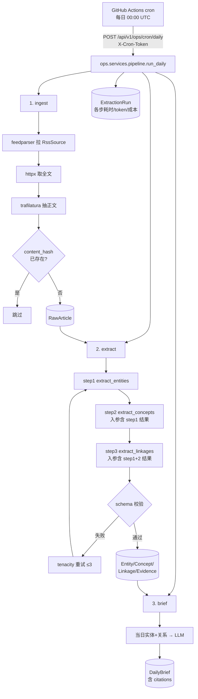

# ARCHITECTURE — news-wiki

> 本文件是实现契约。模型字段、API 路径、响应结构以此为准，不要自行发明。

## 1. 目录树

```
news-wiki/
├── backend/
│   ├── manage.py
│   ├── pyproject.toml            # ruff 配置
│   ├── pytest.ini
│   ├── requirements.txt
│   ├── requirements-dev.txt
│   ├── config/
│   │   ├── settings/
│   │   │   ├── base.py           # 公共配置，从 .env 读
│   │   │   ├── dev.py            # DEBUG=True，控制台日志
│   │   │   └── prod.py           # DEBUG=False，文件日志，安全头
│   │   ├── urls.py               # /api/v1/ 路由汇总 + /api/v1/docs/
│   │   ├── wsgi.py
│   │   └── asgi.py
│   ├── apps/
│   │   ├── common/
│   │   │   ├── exceptions.py     # AppError / LLMError / FetchError / RateLimitedError
│   │   │   ├── drf_exceptions.py # exception_handler，统一 {code, detail} 响应
│   │   │   ├── pagination.py     # DefaultPagination(page_size=20)
│   │   │   ├── throttling.py     # DemoWriteThrottle
│   │   │   ├── budget.py         # 日预算熔断
│   │   │   ├── llm/
│   │   │   │   ├── client.py     # LLMClient 协议（Protocol）
│   │   │   │   ├── glm.py        # GLMClient 实现
│   │   │   │   ├── factory.py    # get_llm_client()，读 settings
│   │   │   │   ├── ratelimit.py  # 令牌桶，进程内共享
│   │   │   │   └── pricing.py    # token → CNY 换算
│   │   │   ├── prompts/          # 独立 app：PromptTemplate/PromptVersion
│   │   │   │   ├── models.py  serializers.py  service.py  seeds.py
│   │   │   │   ├── views.py  urls.py  migrations/
│   │   │   └── management/commands/seed_demo.py
│   │   ├── ingest/
│   │   │   ├── models.py         # RssSource, RawArticle
│   │   │   ├── serializers.py  filters.py  views.py  urls.py  admin.py
│   │   │   ├── fetchers/
│   │   │   │   ├── base.py       # ArticleFetcher 协议
│   │   │   │   ├── rss.py        # feedparser 拉 feed
│   │   │   │   ├── article.py    # httpx + trafilatura 抽正文（默认）
│   │   │   │   └── playwright.py # 可选，仅本地（ADR-001）
│   │   │   └── services/ingest.py
│   │   ├── wiki/
│   │   │   ├── models.py         # Entity, Concept, Linkage, Evidence
│   │   │   ├── serializers.py  filters.py  views.py  urls.py  admin.py
│   │   │   └── services/
│   │   │       ├── extract_pipeline.py  # ★ 三步抽取
│   │   │       ├── validators.py        # JSON schema 校验
│   │   │       └── normalize.py         # 实体名归一化与合并
│   │   ├── brief/
│   │   │   ├── models.py         # DailyBrief
│   │   │   ├── serializers.py  views.py  urls.py  admin.py
│   │   │   └── services/generate.py
│   │   └── ops/
│   │       ├── models.py         # ExtractionRun
│   │       ├── serializers.py  views.py  urls.py  admin.py
│   │       └── services/pipeline.py     # 编排 ingest→extract→brief
│   └── tests/
│       ├── conftest.py           # mock LLM fixture
│       ├── common/  ingest/  wiki/  brief/  ops/
│       └── integration/test_e2e.py
├── frontend/
│   ├── package.json  vite.config.ts  tsconfig.json  vitest.config.ts
│   └── src/
│       ├── main.ts  App.vue
│       ├── router/index.ts
│       ├── api/{client,ingest,wiki,brief,ops}.ts
│       ├── types/{ingest,wiki,brief,ops}.ts
│       ├── stores/{wiki,brief,ops}.ts
│       ├── composables/{useApi,usePolling}.ts
│       ├── components/{AppHeader,AppSider,DataTable,EmptyState,ErrorState,LoadingPanel}.vue
│       ├── views/
│       │   ├── brief/BriefView.vue
│       │   ├── wiki/{EntityListView,EntityDetailView,GraphView}.vue
│       │   │   └── components/{EvidenceCard,LinkageGroup,GraphChart}.vue
│       │   └── ops/{OpsView.vue, components/RunDetail.vue}
│       └── styles/{index,tokens}.scss
├── deploy/
│   ├── Caddyfile
│   └── docker-compose.prod.yml
├── .github/workflows/{ci.yml,cron-daily.yml,deploy.yml}
├── Dockerfile
├── docker-compose.yml
├── .env.example  .gitignore  LICENSE  README.md  CLAUDE.md
└── docs/
```

---

## 2. 数据流



**编排入口**：`apps/ops/services/pipeline.py::run_daily(source_ids=None) -> ExtractionRun`
三步任一失败，`ExtractionRun.status` 置 `partial` 或 `failed`，但**已成功的步骤结果保留**（不整体回滚）。每步内部各自 `transaction.atomic()`。

---

## 3. 数据模型（字段级契约）

### 3.1 `apps/ingest/models.py`

```python
class RssSource(models.Model):
    name            = CharField(max_length=200)
    url             = URLField(unique=True)
    site_url        = URLField(blank=True)
    enabled         = BooleanField(default=True)
    last_fetched_at = DateTimeField(null=True, blank=True)
    last_error      = TextField(blank=True)
    created_at      = DateTimeField(auto_now_add=True)

    class Meta:
        ordering = ["name"]


class RawArticle(models.Model):
    EXTRACT_STATUS = [("pending","Pending"), ("extracted","Extracted"),
                      ("failed","Failed"), ("skipped","Skipped")]

    source          = ForeignKey(RssSource, on_delete=CASCADE,
                                 related_name="articles", null=True, blank=True)
    title           = CharField(max_length=500)
    url             = URLField(max_length=1000)
    content         = TextField()                 # trafilatura 抽取的正文
    summary         = TextField(blank=True)       # RSS 自带 summary，原样保留
    author          = CharField(max_length=200, blank=True)
    publish_time    = DateTimeField(null=True, blank=True)
    content_hash    = CharField(max_length=64, unique=True)   # sha256(url + normalized_title)
    lang            = CharField(max_length=10, blank=True)
    extract_status  = CharField(max_length=20, choices=EXTRACT_STATUS, default="pending")
    fetched_at      = DateTimeField(auto_now_add=True)

    class Meta:
        ordering = ["-publish_time", "-fetched_at"]
        indexes  = [Index(fields=["extract_status"]),
                    Index(fields=["-publish_time"])]
```

> `content_hash` 用 `sha256((url.strip().lower() + "|" + " ".join(title.lower().split())).encode())`，实现放 `apps/ingest/services/ingest.py::compute_hash`。

### 3.2 `apps/wiki/models.py`

```python
class Entity(models.Model):
    ENTITY_TYPES = [("person","Person"), ("org","Organization"),
                    ("product","Product"), ("model","Model"),
                    ("tech","Technology"), ("event","Event"), ("other","Other")]

    name            = CharField(max_length=255)
    normalized_name = CharField(max_length=255)   # " ".join(name.lower().split())
    entity_type     = CharField(max_length=20, choices=ENTITY_TYPES)
    aliases         = JSONField(default=list, blank=True)     # list[str]
    summary         = TextField(blank=True)                   # AI 生成的词条摘要
    confidence      = FloatField(default=1.0)                 # 0.0-1.0
    mention_count   = PositiveIntegerField(default=0)
    first_seen_at   = DateTimeField(null=True, blank=True)
    last_seen_at    = DateTimeField(null=True, blank=True)
    created_at      = DateTimeField(auto_now_add=True)
    updated_at      = DateTimeField(auto_now=True)

    class Meta:
        ordering = ["-mention_count", "normalized_name"]
        constraints = [UniqueConstraint(fields=["normalized_name","entity_type"],
                                        name="uniq_entity_norm_type")]
        indexes = [Index(fields=["entity_type"])]


class Concept(models.Model):
    name        = CharField(max_length=255)
    namespace   = CharField(max_length=80)        # 如 "technique" / "trend" / "policy"
    definition  = TextField(blank=True)
    signals     = JSONField(default=list, blank=True)   # list[str]，触发该概念的关键信号词
    confidence  = FloatField(default=1.0)
    created_at  = DateTimeField(auto_now_add=True)
    updated_at  = DateTimeField(auto_now=True)

    class Meta:
        ordering = ["namespace","name"]
        constraints = [UniqueConstraint(fields=["namespace","name"],
                                        name="uniq_concept_ns_name")]


class Linkage(models.Model):
    subject_entity = ForeignKey(Entity, on_delete=CASCADE, related_name="outgoing_linkages")
    predicate      = CharField(max_length=80)     # 中文谓词，如 "发布" / "收购" / "采用"
    object_entity  = ForeignKey(Entity, on_delete=CASCADE, related_name="incoming_linkages",
                                null=True, blank=True)
    object_concept = ForeignKey(Concept, on_delete=CASCADE, related_name="linkages",
                                null=True, blank=True)
    confidence     = FloatField(default=1.0)
    created_at     = DateTimeField(auto_now_add=True)
    updated_at     = DateTimeField(auto_now=True)

    class Meta:
        constraints = [
            CheckConstraint(check=Q(object_entity__isnull=False) | Q(object_concept__isnull=False),
                            name="linkage_object_required"),
            UniqueConstraint(fields=["subject_entity","predicate","object_entity","object_concept"],
                             name="uniq_linkage_triple"),
        ]


class Evidence(models.Model):
    """一条 Evidence 只能指向 entity / concept / linkage 三者之一。"""
    raw_article       = ForeignKey("ingest.RawArticle", on_delete=CASCADE, related_name="evidences")
    entity            = ForeignKey(Entity,  on_delete=CASCADE, null=True, blank=True, related_name="evidences")
    concept           = ForeignKey(Concept, on_delete=CASCADE, null=True, blank=True, related_name="evidences")
    linkage           = ForeignKey(Linkage, on_delete=CASCADE, null=True, blank=True, related_name="evidences")
    snippet           = TextField()               # 原文片段，≤500 字
    extraction_run    = ForeignKey("ops.ExtractionRun", on_delete=CASCADE, related_name="evidences")
    prompt_key        = CharField(max_length=100) # 如 "wiki.extract_linkages"
    prompt_version    = PositiveIntegerField()
    created_at        = DateTimeField(auto_now_add=True)

    class Meta:
        constraints = [CheckConstraint(
            check=(Q(entity__isnull=False, concept__isnull=True,  linkage__isnull=True)
                 | Q(entity__isnull=True,  concept__isnull=False, linkage__isnull=True)
                 | Q(entity__isnull=True,  concept__isnull=True,  linkage__isnull=False)),
            name="evidence_single_target")]
```

> **`prompt_key` + `prompt_version` 落在 Evidence 上**，这是词条页能显示「本条由 prompt v2 抽出」的数据来源。

### 3.3 `apps/ops/models.py`

```python
class ExtractionRun(models.Model):
    STATUS = [("running","Running"), ("success","Success"),
              ("partial","Partial"), ("failed","Failed")]
    TRIGGERS = [("cron","Cron"), ("manual","Manual"), ("seed","Seed")]

    run_id          = CharField(max_length=32, unique=True)   # uuid4().hex
    status          = CharField(max_length=20, choices=STATUS, default="running")
    trigger         = CharField(max_length=20, choices=TRIGGERS, default="cron")
    step_metrics    = JSONField(default=dict)   # 结构见下
    prompt_versions = JSONField(default=dict)   # {"wiki.extract_entities": 2, ...}
    articles_in     = PositiveIntegerField(default=0)
    entities_saved  = PositiveIntegerField(default=0)
    concepts_saved  = PositiveIntegerField(default=0)
    linkages_saved  = PositiveIntegerField(default=0)
    prompt_tokens   = PositiveIntegerField(default=0)
    completion_tokens = PositiveIntegerField(default=0)
    total_tokens    = PositiveIntegerField(default=0)
    cost_cny        = DecimalField(max_digits=10, decimal_places=4, default=0)
    elapsed_ms      = PositiveIntegerField(default=0)
    error_message   = TextField(blank=True)
    started_at      = DateTimeField(auto_now_add=True)
    finished_at     = DateTimeField(null=True, blank=True)

    class Meta:
        ordering = ["-started_at"]
```

`step_metrics` 的结构（键固定为下列六个之一）：

```json
{
  "ingest":            {"status":"done","elapsed_ms":4210,"fetched":12,"deduped":3,"saved":9},
  "extract_entities":  {"status":"done","elapsed_ms":8300,"prompt_tokens":5120,
                        "completion_tokens":890,"count":24,"attempts":1},
  "extract_concepts":  {"status":"done","elapsed_ms":6100,"prompt_tokens":6300,
                        "completion_tokens":540,"count":11,"attempts":2},
  "extract_linkages":  {"status":"done","elapsed_ms":9800,"prompt_tokens":7800,
                        "completion_tokens":1200,"count":31,"attempts":1},
  "persist":           {"status":"done","elapsed_ms":320,"entities":24,"concepts":11,"linkages":31},
  "brief":             {"status":"done","elapsed_ms":5400,"prompt_tokens":3200,
                        "completion_tokens":1500}
}
```
失败时该步为 `{"status":"failed","elapsed_ms":N,"error_message":"...","attempts":3}`。

### 3.4 `apps/brief/models.py`

```python
class DailyBrief(models.Model):
    date          = DateField(unique=True)
    title         = CharField(max_length=300)
    content_md    = TextField()          # 正文含 [1][2] 角标
    citations     = JSONField(default=list)
    model_name    = CharField(max_length=80)
    extraction_run= ForeignKey("ops.ExtractionRun", on_delete=SET_NULL,
                               null=True, blank=True, related_name="briefs")
    created_at    = DateTimeField(auto_now_add=True)

    class Meta:
        ordering = ["-date"]
```

`citations` 结构：
```json
[{"index":1,"raw_article_id":42,"title":"OpenAI 发布 GPT-5",
  "url":"https://...","publish_time":"2026-08-27T10:00:00Z"}]
```

### 3.5 `apps/common/prompts/models.py`

沿用旧项目结构，字段不变：`PromptTemplate(key, name, description, default_text, current_version, created_at)`、`PromptVersion(template, version_no, text, note, is_default, created_at)`。

---

## 4. API 契约

**统一前缀** `/api/v1/`。**统一错误响应**：`{"code": "SOME_CODE", "detail": "人类可读说明"}`，由 `apps/common/drf_exceptions.py` 产出。**列表接口统一分页**：`{"count": N, "next": url|null, "previous": url|null, "results": [...]}`。

| 方法 | 路径 | 说明 | 限流 |
|---|---|---|---|
| GET | `/api/v1/ingest/sources/` | RSS 源列表 | — |
| POST | `/api/v1/ingest/sources/` | 新增源 | demo-write |
| GET | `/api/v1/ingest/articles/` | 原始文章列表。filter: `source`,`extract_status`,`search`(title) | — |
| GET | `/api/v1/ingest/articles/{id}/` | 文章详情（含全文） | — |
| GET | `/api/v1/wiki/entities/` | 实体列表。filter: `entity_type`,`search`(name/alias)，排序 `-mention_count` | — |
| GET | `/api/v1/wiki/entities/{id}/` | **词条详情**，见下方响应结构 | — |
| GET | `/api/v1/wiki/concepts/` | 概念列表。filter: `namespace`,`search` | — |
| GET | `/api/v1/wiki/concepts/{id}/` | 概念详情 | — |
| GET | `/api/v1/wiki/graph/` | 图谱数据。query: `entity_type`,`namespace`,`limit`(默认 100) | — |
| POST | `/api/v1/wiki/extract/` | 手动触发抽取。body `{"article_ids":[1,2]}` | **demo-write** |
| GET | `/api/v1/brief/` | 简报列表（不含正文） | — |
| GET | `/api/v1/brief/latest/` | 最新一期简报（含正文与 citations） | — |
| GET | `/api/v1/brief/{date}/` | 指定日期简报，`date` 格式 `YYYY-MM-DD` | — |
| GET | `/api/v1/ops/runs/` | run 列表 | — |
| GET | `/api/v1/ops/runs/{run_id}/` | run 详情（含 step_metrics） | — |
| GET | `/api/v1/ops/stats/` | 近 7 天聚合：run 数/成功率/token/成本 | — |
| POST | `/api/v1/ops/cron/daily` | **cron 专用**，需 `X-Cron-Token` header | 免限流 |
| GET | `/api/v1/prompts/` | Prompt 模板列表（含当前版本全文，只读） | — |
| GET | `/api/v1/health/` | 健康检查 `{"status":"ok","db":"ok"}` | — |
| GET | `/api/v1/docs/` | Swagger UI（drf-spectacular） | — |

### 4.1 词条详情响应结构（`GET /api/v1/wiki/entities/{id}/`）

前端词条页完全依赖这一个接口，**不要拆成多个请求**。

```json
{
  "id": 12,
  "name": "OpenAI",
  "entity_type": "org",
  "entity_type_display": "Organization",
  "aliases": ["Open AI"],
  "summary": "美国人工智能研究公司……",
  "confidence": 0.95,
  "mention_count": 17,
  "first_seen_at": "2026-08-01T08:00:00Z",
  "last_seen_at": "2026-08-27T09:30:00Z",
  "linkages": [
    {
      "id": 88,
      "direction": "out",
      "predicate": "发布",
      "object": {"kind": "entity", "id": 45, "name": "GPT-5", "entity_type": "product"},
      "confidence": 0.92,
      "evidences": [
        {
          "id": 301,
          "snippet": "OpenAI 于本周正式发布 GPT-5，主打推理能力提升。",
          "prompt_key": "wiki.extract_linkages",
          "prompt_version": 2,
          "run_id": "a3f9c1e2...",
          "article": {
            "id": 42,
            "title": "OpenAI 发布 GPT-5",
            "url": "https://example.com/gpt5",
            "publish_time": "2026-08-27T10:00:00Z",
            "source_name": "机器之心"
          }
        }
      ]
    }
  ]
}
```

`direction` 为 `"out"`（本实体是 subject）或 `"in"`（本实体是 object）。`object.kind` 为 `"entity"` 或 `"concept"`。

> **N+1 警告**：该接口必须用 `select_related` / `prefetch_related` 一次取全。实现后用 `django-debug-toolbar` 或 `assertNumQueries` 确认查询数 < 10。

### 4.2 图谱响应结构（`GET /api/v1/wiki/graph/`）

直接对齐 ECharts `graph` 系列的数据格式，前端不做转换：

```json
{
  "nodes": [
    {"id": "e12", "name": "OpenAI", "category": "org",     "value": 17, "symbolSize": 40},
    {"id": "c3",  "name": "混合专家模型", "category": "technique", "value": 5, "symbolSize": 22}
  ],
  "links": [
    {"source": "e12", "target": "e45", "predicate": "发布", "value": 0.92}
  ],
  "categories": [{"name": "org"}, {"name": "product"}, {"name": "technique"}],
  "truncated": false
}
```

节点 `id` 用 `"e"+entity_id` / `"c"+concept_id` 前缀避免撞号。`symbolSize` 由后端算好（建议 `min(60, 12 + value * 2)`）。

**查询参数**（结构不变，以下均为可选，详见 ADR-015）：

| 参数 | 默认 | 说明 |
|---|---|---|
| `entity_type` | 全部 | 只保留这些类型的实体节点，逗号分隔可传多个 |
| `namespace` | 全部 | 只保留这些命名空间的概念节点，逗号分隔可传多个 |
| `limit` | `100` | 节点数上限，硬上限 500。见 ADR-018 |
| `min_degree` | `1` | 最少关系数。默认隐藏孤立节点；传 `0` 显示全部并改用按排名截断 |
| `center` | — | 邻域图的中心节点 id（如 `e12`）。中心节点必定保留，不存在时返回空图 |
| `depth` | `1` | 邻域跳数，上限 3。仅在传了 `center` 时生效 |

**选点规则**：超过 `limit` 时按**关系密度**选点——边按两端度数之和排序，
依次收录端点直到预算用尽，使进入画布的每个节点都至少带一条边。
`min_degree=0` 或装不下任何一条边时回落为按度数排名截断。
`truncated=true` 表示发生过截断。

---

## 5. LLM 客户端契约

```python
# apps/common/llm/client.py
class LLMResult(TypedDict):
    content: str
    prompt_tokens: int
    completion_tokens: int
    total_tokens: int
    model: str

class LLMClient(Protocol):
    def chat(self, messages: list[dict], **opts) -> LLMResult: ...
```

**与旧项目的关键差异**：`chat()` 必须返回 `LLMResult` 而不是裸 `str`。旧实现 `return response.choices[0].message.content` 丢掉了 usage，导致观测面板拿不到 token 数。新实现必须从 `response.usage` 读取 `prompt_tokens` / `completion_tokens` / `total_tokens`，缺失时填 0 而不是 None。

**成本换算**（`apps/common/llm/pricing.py`）：价格表以 `dict[model_name, (input_per_1k, output_per_1k)]` 硬编码 + 环境变量可覆盖（`LLM_PRICE_<MODEL>=<输入>,<输出>`），单位人民币元。按官网价填，注释里写明「价格可能变动，以官网为准」。限时促销价不进表——促销到期后会让成本记账悄悄少算。

**限流**：`ratelimit.py` 令牌桶，进程内共享，`LLM_RATE_LIMIT_RPM` 控制。

---

## 6. 前端路由

| 路径 | 组件 | 说明 |
|---|---|---|
| `/` | `brief/BriefView.vue` | 今日简报（首页） |
| `/wiki` | `wiki/EntityListView.vue` | 实体列表，可搜索/按类型筛选 |
| `/wiki/:id` | `wiki/EntityDetailView.vue` | ★ 词条页 |
| `/graph` | `wiki/GraphView.vue` | 关系图谱 |
| `/ops` | `ops/OpsView.vue` | 流水线面板 |

**API base URL**：同源部署时为 `/api/v1`（Caddy 反代）；分离部署时读 `import.meta.env.VITE_API_BASE`。默认走同源。

---

## 7. 配置项（`.env`）

| 变量 | 默认 | 说明 |
|---|---|---|
| `DJANGO_ENV` | `dev` | `dev` / `prod`，决定加载哪个 settings |
| `SECRET_KEY` | — | **必填** |
| `ALLOWED_HOSTS` | `localhost,127.0.0.1` | 逗号分隔 |
| `DATABASE_URL` | — | `postgres://user:pass@db:5432/newswiki` |
| `GLM_API_KEY` | — | **必填** |
| `GLM_MODEL` | `glm-5.3-flash` | 推理模型，思考关不掉。换成非推理模型时把 `LLM_TIMEOUT_SECONDS` 一起调回去 |
| `GLM_BASE_URL` | `https://open.bigmodel.cn/api/paas/v4` | |
| `LLM_RATE_LIMIT_RPM` | `60` | |
| `LLM_TIMEOUT_SECONDS` | `300` | 单次请求超时（客户端自身重试之前）。推理模型一次要几分钟，跟着 `GLM_MODEL` 一起调 |
| `LLM_DAILY_BUDGET_CNY` | `5.0` | 熔断阈值 |
| `DEMO_MODE` | `true` | 开启后写操作走 IP 限流 |
| `DEMO_WRITE_RATE` | `3/day` | DRF throttle 速率字符串 |
| `READ_RATE` | `120/min` | 只读接口的每 IP 上限，留空关闭（ADR-015 之外的容量护栏） |
| `INGEST_TOPIC_FILTER` | `true` | 入库前按 AI 主题关键词过滤，纯 AI 源自动豁免（ADR-016） |
| `ADMIN_ALLOWED_IPS` | `192.0.2.1` | `/admin/` 的 IP 白名单，**Caddy 层生效**，默认值谁也匹配不到 |
| `CRON_TOKEN` | — | **必填**，cron 端点鉴权 |
| `HTTP_PROXY` / `HTTPS_PROXY` | 空 | 可选出站代理，留空即直连 |
| `CORS_ALLOWED_ORIGINS` | 空 | 同源部署时留空 |
| `LOG_DIR` | `backend/logs` | |

---

## 8. 实现须知

1. **抽取分批**：一次 LLM 调用最多喂 5 篇文章，正文各截断到 4000 字符。超过则分批多次调用，结果合并。批次大小放 `settings.EXTRACT_BATCH_SIZE`。
2. **实体归一化**：`normalize.py::normalize_name(name)` = `" ".join(name.lower().split())`。落库用 `update_or_create(normalized_name=..., entity_type=...)`。别名合并时取并集后排序去重。
3. **谓词收敛**：LLM 容易生成同义谓词（"发布"/"推出"/"发行"）。`normalize.py` 里放一张 `PREDICATE_ALIASES` 映射表做归一，映射不到的保留原样。这张表是 D4 的产出之一。
4. **prompt 版本记录**：每次抽取开始时快照当前各 prompt 的 `version_no` 写进 `ExtractionRun.prompt_versions`，同时写进每条 `Evidence`。抽取中途不重新读取。
5. **时区**：`TIME_ZONE = "Asia/Shanghai"`，`USE_TZ = True`。DB 存 UTC，序列化输出 ISO8601 带时区。
6. **Gunicorn**：`--workers 3 --threads 2 --timeout 120`。抽取是长任务，走后台线程 + 立即返回 `run_id`，前端轮询 `/api/v1/ops/runs/{run_id}/`（复用 `usePolling`）。
